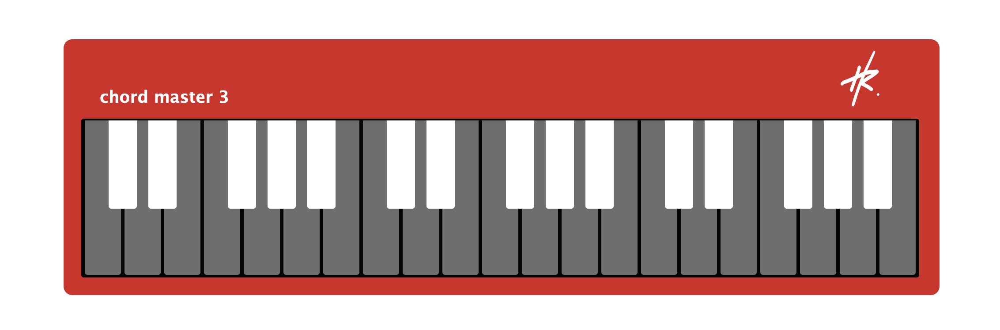

# chord master 3

What starts out as a picture of a keyboard layout. Created entirely with html & css, hopefully soon becomes a fully functional music app. However, I would love to collaborate on this project. Feel free to contribute in any way, so we can see this app to completion. The goal is to make a working digital variant of the popular nord stage keyboard. Then possibly, eventually a plugin ??

Initially appeared on [GitHub (repo)](https://github.com/harlanray/chordMaster3).

## Getting Started and Installing

CURRENT BUILD:

Download a copy of the code from the GitHub repo and move to desired folder on your local machine. Then you can open or drag the folder to the IDE for your choice. Once all files and folders have populated, right click on the index.html file -> click "Open with Live Server."

Project will open in deafult browser window for which you can use to help visualize edits that you make in the code, etc.

### Style test

Checks if the best practices and the right coding styles have been used.

    Prettier v10.1.0

## Deployment

N/A

## 🛠️ Built With

## Contributing

N/A

## 🌏 Browser Support

|  Chrome |  Internet Explorer |  Edge |  Safari |  Firefox |
| :---------: | :---------: | :---------: | :---------: | :---------: |
| Yes | 11+ | Yes | Yes | Yes |

## Versioning [work in progress]

We use [Semantic Versioning](http://semver.org/) for versioning. For the versions available, see the [tags on this repository](https://github.com/harlanray/chordMaster3/releases).

## Authors

  - **Harlan Ray [HЯ]** - *Provided README & Source Code* -
    [GitHub Profile](https://github.com/harlanray)

## License

N/A

## Acknowledgments

  - Based on the [freeCodeCamp](https://www.freecodecamp.org/learn/2022/responsive-web-design/learn-responsive-web-design-by-building-a-piano/step-1) course project 
  - Inspired by the popular nord stage synthesizer keyboards. Used in major studios and poular musicians everywhere!